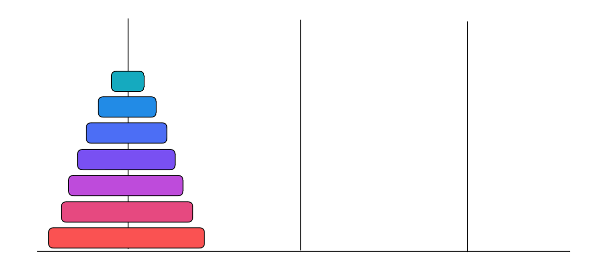
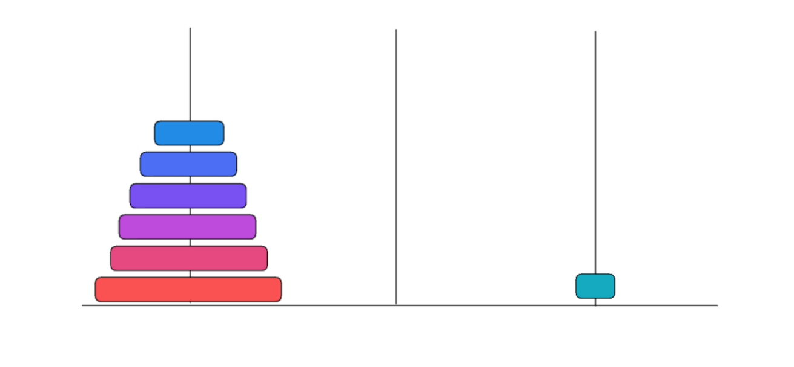
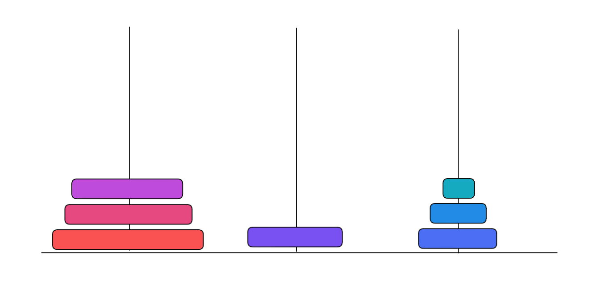
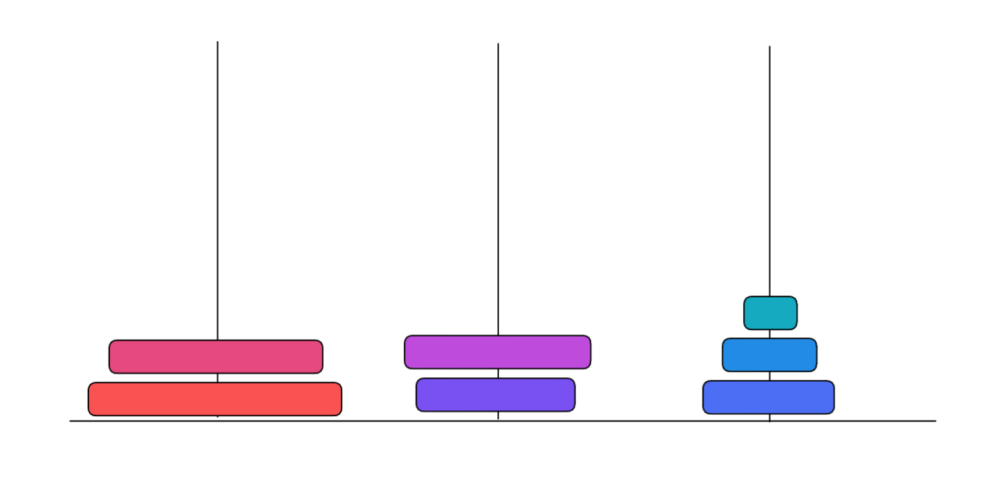

# Hanoi towers

Hanoi tower is a popular puzzle. In traditional version of the game there are three stacks and seven discs of different sizes, at the beginning all discs are on the first stack.



Player can move one disc per move from top of one stack to top of another stack.




However a bigger disc **cannot** be placed on a smaller one. Combination shown below is illegal.



Game is finished when all discs have been moved to the last stack.

In our version we will allow playing with **any number of stacks**. You are given an input from a player and need to validate whether the puzzle has been solved. First line of input contains space separated number of discs and number of stacks. Remaining lines contain player's moves.
Example input with explanation:
```
2 3 <- two discs and  three stacks
1 2 <- move top disc from first stack to second stack
1 3 <- move top disc from first stack to third stack
2 3 <- move top disc from second stack to third stack
```

In files `input_01.txt`, `input_02.txt` and `input_03.txt` you will find player's input for three different games.

## What you need to do

Your task is to write a Python program that will read user input from a file and follow the moves. If at any point of the game the player either does an illegal move or solves the puzzle, your program should print proper message to console and exit.
